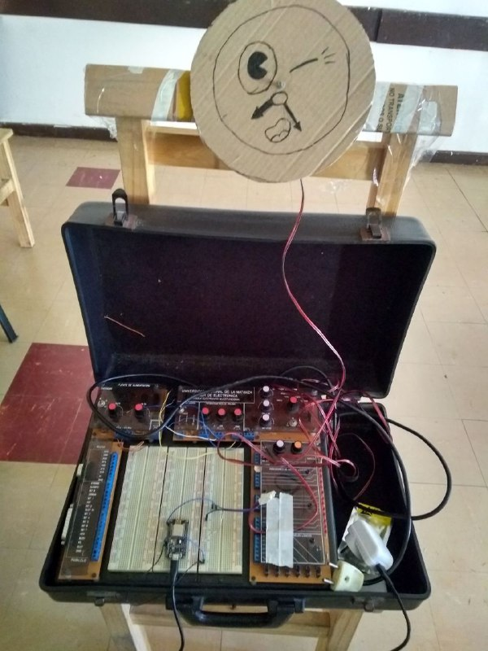

# SalvandoLaCena


## Cómo iniciar el proyecto:


```
python3 -m venv directorio_entorno
. directorio_entorno/bin/activate
pip install -r requirements.txt
```


## De qué se trata:

### La anécdota

En el día previo al pycamp 2022 hicimos un asado al aire libre.  El
problema es que se largó a llover y tuvimos que salvar la cena,
moviendo todas las cosas (parrilla incluida) hasta un quincho que
estaba bastante lejos.

### Qué hicimos

La idea propuesta por Hugo era la de hacer un juego de plataformas,
con la vuelta de rosca de que se pueda volver el tiempo hacia atrás y
corregir los errores que hizo el jugador o jugadora.  Junto con la
anécdota del asado, la idea fue mutando a un minijuego en el que
participan dos jugadores: una persona controla el personaje y la otra
controla el tiempo. Lxs jugadorxs deben llevar la comida y demás cosas
de un lado a otro de la pantalla, haciéndolas rebotar y evitando que
caigan al suelo, salvando así a la cena.

La persona que controla el tiempo lo hace con un volante pegado a un
potenciómetro que se comunica por wifi al proceso del juego. Con esto
no solamente se puede ir para atrás en el tiempo sino también variar
la velocidad suavemente, tanto para adelante como para atrás.  Para
probar, se puede emular el volante moviendo el mouse en la pantalla.



La persona que controla al personaje lo hace con un joystick, aunque
también se pueden usar las flechitas del teclado para probar. El
personaje tiene el poder de que no obedece a los cambios de tiempo, y
esto es lo que hace al juego súper divertido y colaborativo entre lxs
dos jugadorxs.
